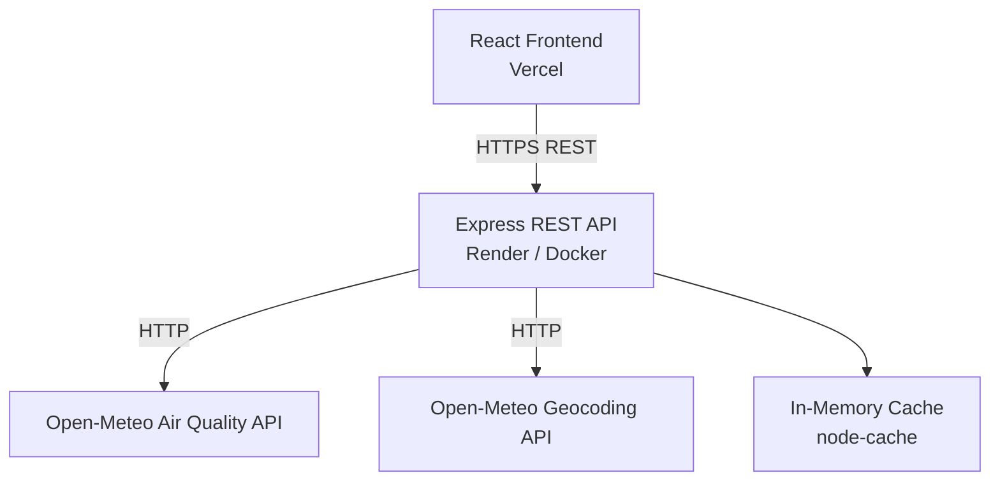

# City-Level Air Quality Monitoring & Forecasting

A full-stack web application that provides real-time air quality monitoring and multi-day forecasting for any city worldwide. The React frontend communicates with a Node.js/Express REST API, which fetches and processes live data from the Open-Meteo Air Quality and Geocoding APIs.

---

## Live Demo

| Service | URL |
|---|---|
| Frontend (Vercel) | https://city-level-air-quality-monitoring-a-lilac.vercel.app/ |
| Backend API (Render) | https://city-level-air-quality-monitoring-and.onrender.com |
| Health Check | https://city-level-air-quality-monitoring-and.onrender.com/api/health |

---

## Features

- **City search** — autocomplete geocoding for any city worldwide
- **Real-time AQI** — US AQI and European AQI for the current hour
- **8 pollutants** — PM2.5, PM10, NO2, O3, CO, SO2, NH3, NO with live concentrations
- **Dominant pollutant detection** — identifies the primary contributor to current AQI
- **48-hour AQI trend** — line chart showing past 24h and next 24h
- **24-hour hourly forecast** — scrollable strip with per-hour AQI and PM2.5
- **5-day daily forecast** — average, min, and max AQI per day
- **4 data visualisation charts** — AQI line chart, pollutant bar chart, 5-day forecast bar chart, pollutant radar chart
- **Health recommendations** — tailored advice for 6 population groups (general public, children, elderly, athletes, heart/lung conditions, pregnant women) based on current AQI
- **Quick-select cities** — one-click access to 10 major cities
- **Geolocation** — use device location for local air quality
- **In-memory response caching** — reduces redundant API calls (default TTL: 10 minutes)
- **Rate limiting** — 100 requests per 15-minute window per IP
- **Security headers** — Helmet middleware on all responses
- **CORS** — configurable allowed origins via environment variable
- **Auto-refresh** — frontend polls for updated data every 10 minutes

---

## Architecture



**Request flow:**
1. User searches for a city → frontend calls `GET /api/air-quality/search?q=`
2. User selects a city → frontend calls `GET /api/air-quality?lat=&lon=&city=&country=`
3. Backend checks in-memory cache; on miss, fetches from Open-Meteo and caches the result
4. Backend processes raw hourly data into current snapshot, time series, hourly forecast, and 5-day daily summary
5. Frontend renders all dashboard components from the single API response

---

## Tech Stack

### Frontend
| Technology | Version | Purpose |
|---|---|---|
| React | 18.2 | UI framework |
| Create React App | 5.0.1 | Build toolchain |
| Axios | 1.6 | HTTP client |
| Recharts | 2.12 | Charts (line, bar, radar) |
| Framer Motion | 11.0 | Animations |
| Lucide React | 0.344 | Icons |

### Backend
| Technology | Version | Purpose |
|---|---|---|
| Node.js | 18 | Runtime |
| Express | 4.22 | HTTP framework |
| Axios | 1.16 | Outbound HTTP to Open-Meteo |
| node-cache | 5.1 | In-memory response cache |
| express-rate-limit | 7.2 | Rate limiting |
| Helmet | 7.1 | Security headers |
| Morgan | 1.10 | HTTP request logging |
| dotenv | 16.6 | Environment variable loading |
| nodemon | 3.0 | Dev auto-restart |

### External APIs
| API | Usage |
|---|---|
| [Open-Meteo Air Quality API](https://open-meteo.com/en/docs/air-quality-api) | Hourly pollutant concentrations, US AQI, EU AQI |
| [Open-Meteo Geocoding API](https://open-meteo.com/en/docs/geocoding-api) | City name to coordinates |

### DevOps & Deployment
| Tool | Purpose |
|---|---|
| Docker | Backend containerisation |
| Render | Backend hosting (Docker deploy) |
| Vercel | Frontend hosting (static CRA build) |
| GitHub | Source control |

---

## Project Structure

```
city-air-quality-monitoring/
├── backend/
│   ├── src/
│   │   ├── routes/
│   │   │   ├── airQuality.js       # /api/air-quality routes
│   │   │   └── geocode.js          # /api/geocode route
│   │   ├── services/
│   │   │   └── airQualityService.js  # Open-Meteo API calls, data processing
│   │   ├── utils/
│   │   │   ├── aqiUtils.js         # AQI calculation, categories, health advice
│   │   │   └── cache.js            # node-cache wrapper
│   │   └── server.js               # Express app, middleware, server entry point
│   ├── .dockerignore
│   ├── .env.example                # Environment variable template
│   ├── Dockerfile
│   ├── package.json
│   └── package-lock.json
├── frontend/
│   ├── public/
│   │   └── index.html
│   ├── src/
│   │   ├── components/
│   │   │   ├── AQIDialGauge.jsx    # Circular AQI gauge
│   │   │   ├── AQILegend.jsx       # AQI scale legend
│   │   │   ├── Charts.jsx          # Line, bar, radar charts (Recharts)
│   │   │   ├── Dashboard.jsx       # Main data layout
│   │   │   ├── FiveDayForecast.jsx # 5-day forecast cards
│   │   │   ├── Header.jsx          # App header with live clock
│   │   │   ├── HealthRecommendations.jsx  # Per-group health advice
│   │   │   ├── HourlyStrip.jsx     # 24h scrollable hourly strip
│   │   │   ├── LoadingScreen.jsx   # Loading state
│   │   │   ├── PollutantGrid.jsx   # 8-pollutant concentration grid
│   │   │   ├── SearchBar.jsx       # City search with autocomplete
│   │   │   ├── StatsRow.jsx        # Summary stats banner
│   │   │   └── WelcomeScreen.jsx   # Initial landing screen
│   │   ├── hooks/
│   │   │   └── useAirQuality.js    # Data fetching hook with auto-refresh
│   │   ├── utils/
│   │   │   ├── api.js              # Axios instance, API call functions
│   │   │   └── aqiHelpers.js       # Frontend AQI formatting helpers
│   │   ├── App.jsx
│   │   ├── index.css
│   │   └── index.js
│   ├── .env.example
│   ├── package.json
│   └── package-lock.json
├── .gitignore
├── package.json                    # Root scripts (concurrently)
└── README.md
```

---

## Local Setup

### Requirements

- Node.js 18 or newer
- npm 8 or newer

### 1. Clone the repository

```bash
git clone https://github.com/varunib/city-air-quality-monitoring.git
cd city-air-quality-monitoring
```

### 2. Install all dependencies

```bash
npm run install:all
```

This installs dependencies for both `backend/` and `frontend/`.

### 3. Configure the backend environment

```bash
cp backend/.env.example backend/.env
```

Edit `backend/.env` as needed. The defaults work for local development without changes.

### 4. Configure the frontend environment (optional for local dev)

```bash
cp frontend/.env.example frontend/.env.local
```

`REACT_APP_API_URL` is optional locally. When unset, the React dev server proxies `/api` requests to `http://localhost:5000` automatically. Set it only if you want to point the frontend at a different backend.

### 5. Run both services together

```bash
npm start
```

This starts the backend with nodemon and the frontend with react-scripts concurrently.

| Service | URL |
|---|---|
| Frontend | http://localhost:3000 |
| Backend API | http://localhost:5000 |

### Run services separately

**Backend:**
```bash
cd backend
npm install
npm run dev       # development (nodemon, auto-restart)
npm start         # production (node)
```

**Frontend:**
```bash
cd frontend
npm install
npm start
```

---

## Environment Variables

### Backend — `backend/.env`

Copy `backend/.env.example` and fill in values:

```bash
cp backend/.env.example backend/.env
```

| Variable | Default | Description |
|---|---|---|
| `PORT` | `5000` | Port the Express server listens on |
| `NODE_ENV` | `production` | Node environment |
| `FRONTEND_ORIGINS` | _(empty)_ | Comma-separated list of allowed CORS origins (e.g. `https://your-app.vercel.app`) |
| `CACHE_TTL_SECONDS` | `600` | In-memory cache TTL in seconds |
| `RATE_LIMIT_WINDOW_MS` | `900000` | Rate limit window in milliseconds (15 min) |
| `RATE_LIMIT_MAX` | `100` | Max requests per window per IP |
| `OPEN_METEO_AQ_URL` | `https://air-quality-api.open-meteo.com/v1/air-quality` | Open-Meteo air quality endpoint |
| `OPEN_METEO_GEO_URL` | `https://geocoding-api.open-meteo.com/v1/search` | Open-Meteo geocoding endpoint |

No API keys are required. Open-Meteo is a free, open-source API.

### Frontend — `frontend/.env.local`

| Variable | Example | Description |
|---|---|---|
| `REACT_APP_API_URL` | `http://localhost:5000` | Backend origin. The frontend appends `/api` automatically. Omit for local dev (proxy handles it). |

---

## Docker

The backend includes a production-ready Dockerfile.

### Build the image

```bash
cd backend
docker build -t aqi-backend .
```

### Run the container

```bash
docker run --rm -p 5000:5000 \
  -e NODE_ENV=production \
  -e FRONTEND_ORIGINS=https://your-app.vercel.app \
  aqi-backend
```

### Verify

```bash
curl http://localhost:5000/api/health
```

The Dockerfile uses `node:18`, installs dependencies with `npm ci` for reproducible builds, and starts the server with `node src/server.js`. The server binds to `0.0.0.0` so it is accessible outside the container.

---

## API Endpoints

Base URL (local): `http://localhost:5000`

### Health check

```
GET /api/health
```

Response:
```json
{
  "status": "ok",
  "service": "City Air Quality Monitoring & Forecasting",
  "version": "1.0.0",
  "timestamp": "2024-01-01T00:00:00.000Z",
  "uptime": 123.45
}
```

### Geocode a city

```
GET /api/geocode?q={city}
```

| Parameter | Required | Description |
|---|---|---|
| `q` | Yes | City name (min 2 characters) |

Example: `GET /api/geocode?q=Mumbai`

Response:
```json
{
  "success": true,
  "results": [
    {
      "name": "Mumbai",
      "country": "India",
      "admin1": "Maharashtra",
      "latitude": 19.07283,
      "longitude": 72.88261,
      "timezone": "Asia/Kolkata",
      "population": 12691836
    }
  ]
}
```

### Search for a city (used by frontend autocomplete)

```
GET /api/air-quality/search?q={city}
```

Same parameters and response shape as `/api/geocode`. Returns up to 6 matching cities.

### Air quality data

```
GET /api/air-quality?lat={lat}&lon={lon}&city={city}&country={country}
```

| Parameter | Required | Description |
|---|---|---|
| `lat` | Yes | Latitude (decimal degrees) |
| `lon` | Yes | Longitude (decimal degrees) |
| `city` | No | City name label (used in response metadata) |
| `country` | No | Country label (used in response metadata) |

Example: `GET /api/air-quality?lat=19.07283&lon=72.88261&city=Mumbai&country=India`

Response shape:
```json
{
  "success": true,
  "data": {
    "meta": { "city", "country", "latitude", "longitude", "timezone", "fetchedAt" },
    "current": { "usAqi", "euAqi", "category", "dominant", "pollutants", "pollutantAqi", "health" },
    "timeSeries": [ ... ],
    "hourlyForecast": [ ... ],
    "dailyForecast": [ ... ]
  }
}
```

`current.pollutants` includes: `pm25`, `pm10`, `no2`, `o3`, `co`, `so2`, `nh3`, `no`.

`dailyForecast` contains 5 days of averaged AQI, PM2.5, PM10, O3, and NO2.

---

## Deployment

### Backend → Render (Docker)

1. Push the repository to GitHub.
2. Create a new **Web Service** on [Render](https://render.com).
3. Select **Docker** as the environment.
4. Set the root directory to `backend/`.
5. Set the following environment variables in the Render dashboard:

| Variable | Value |
|---|---|
| `NODE_ENV` | `production` |
| `FRONTEND_ORIGINS` | `https://your-app.vercel.app` |
| `CACHE_TTL_SECONDS` | `600` |
| `RATE_LIMIT_WINDOW_MS` | `900000` |
| `RATE_LIMIT_MAX` | `100` |

Render sets `PORT` automatically. The server reads `process.env.PORT` and binds to `0.0.0.0`.

### Frontend → Vercel

1. Import the repository on [Vercel](https://vercel.com).
2. Set the **root directory** to `frontend/`.
3. Set the following build-time environment variable:

| Variable | Value |
|---|---|
| `REACT_APP_API_URL` | `https://your-api.onrender.com` |

The frontend appends `/api` to this value automatically. Do not include `/api` in the variable.

4. Deploy. Vercel runs `npm run build` and serves the static output.

---

## Security

| Measure | Implementation |
|---|---|
| Security headers | Helmet middleware sets `X-Content-Type-Options`, `X-Frame-Options`, `Strict-Transport-Security`, and other headers on every response |
| CORS | Strict origin allowlist; only `localhost:3000` and origins listed in `FRONTEND_ORIGINS` are permitted |
| Rate limiting | `express-rate-limit` — 100 requests per 15-minute window per IP, with standard `RateLimit-*` headers |
| Environment variables | All configuration via `.env`; real `.env` files are excluded from version control via `.gitignore` |
| Input validation | `lat`/`lon` validated as numbers within valid coordinate ranges; query strings validated for minimum length before forwarding to external APIs |

---

## Performance & Reliability

| Feature | Detail |
|---|---|
| Response caching | `node-cache` stores geocoding and air quality responses in memory for 10 minutes (configurable via `CACHE_TTL_SECONDS`), reducing redundant calls to Open-Meteo |
| Request timeouts | Geocoding requests timeout at 8 seconds; air quality requests at 12 seconds |
| Auto-refresh | Frontend re-fetches air quality data every 10 minutes automatically |
| Error handling | Centralised Express error handler returns structured JSON errors with appropriate HTTP status codes |
| HTTP logging | Morgan logs all incoming requests in development |
| 0.0.0.0 binding | Server binds to all interfaces for correct behaviour inside Docker and on Render |

---

## Future Enhancements

- Historical air quality data and trend analysis over weeks or months
- Push notifications or email alerts when AQI exceeds a user-defined threshold
- Map view showing air quality across multiple cities simultaneously
- Comparison view for two or more cities side by side
- PWA support for offline access and home screen installation
- User accounts to save favourite cities

---

## Author

**Varuni Bennur**

GitHub: [https://github.com/varunib](https://github.com/varunib)
